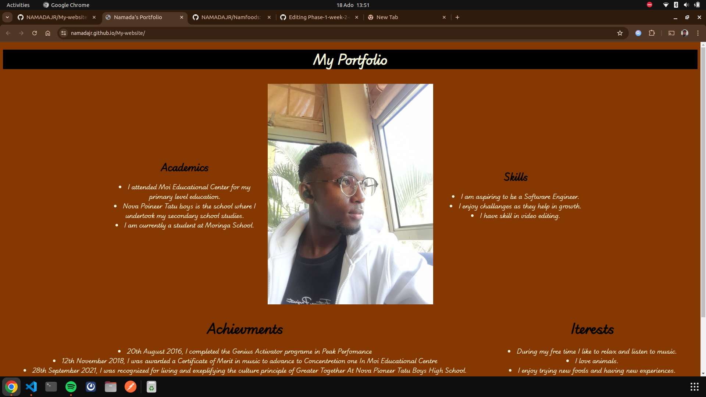
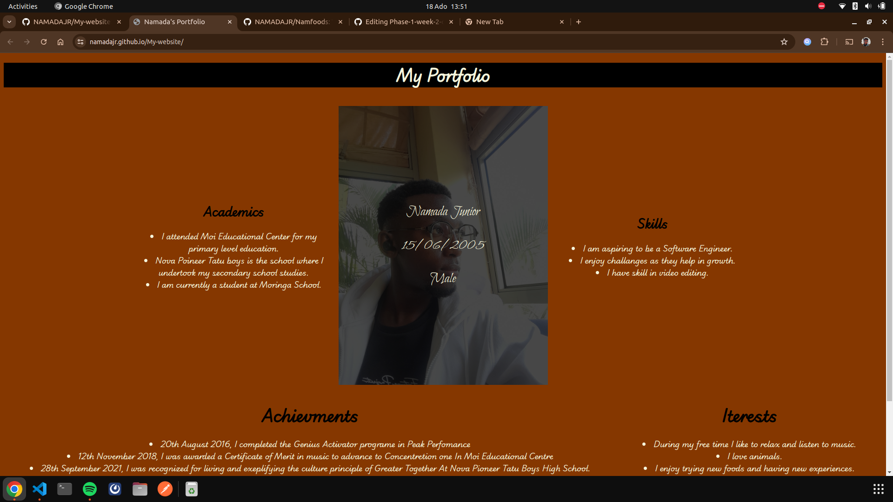

# My Personal Website

## By Namada Junior

## Project Description

The website is a simple shopping list website that allows users to add items to a list and check them off when they have been purchased. The website is built using HTML, CSS, and JavaScript and uses a simple button to add items to the list and a clear button to remove all items from the list. The website also uses some custom fonts and colors to make it visually appealing.

Here is the link to the website [(https://namadajr.github.io/Phase-1-week-2-codechallange/)](https://namadajr.github.io/Phase-1-week-2-codechallange/)

## Features of the website

This is how the website looks upon being loaded on to the browser.


This is how the website looks you hover on the image; details such as name, age and gender appear.


## Properties of the website

### HTML

This is the struscture of the html landing page

```html
<!DOCTYPE html>
<html lang="en">
  <head>
    <meta charset="UTF-8" />
    <meta name="viewport" content="width=device-width, initial-scale=1.0" />
    <title>Namada's Portfolio</title>
    <link rel="stylesheet" href="css/style.css" />
    <link
      rel="stylesheet"
      href="https://cdnjs.cloudflare.com/ajax/libs/font-awesome/6.5.2/css/all.min.css"
      integrity="sha512-SnH5WK+bZxgPHs44uWIX+LLJAJ9/2PkPKZ5QiAj6Ta86w+fsb2TkcmfRyVX3pBnMFcV7oQPJkl9QevSCWr3W6A=="
      crossorigin="anonymous"
      referrerpolicy="no-referrer"
    />
  </head>
  <body>
    <div class="title">
      <h1>My Portfolio</h1>
    </div>

    <br />

    <div class="slogan">
      <div class="box1">
        <h2>Academics</h2>

        <p>
          <li>
            I attended Moi Educational Center for my primary level education.
          </li>
          <li>
            Nova Poineer Tatu boys is the school where I undertook my secondary
            school studies.
          </li>
          <li>I am currently a student at Moringa School.</li>
        </p>

        <p></p>
      </div>

      <div class="image">
        
      </div>

      <div class="words">
        <h1>
          <p>Namada Junior</p>
          <p>15/06/2005</p>
          <p>Male</p>
        </h1>
      </div>

      <div class="box2">
        <h2>Skills</h2>

        <p>
          <li>I am aspiring to be a Software Engineer.</li>
          <li>I enjoy challanges as they help in growth.</li>
          <li>I have skill in video editing.</li>
        </p>
      </div>
    </div>

    <br />

    <div class="rest">
      <div>
        <h1>Achievments</h1>

        <li>
          20th August 2016, I completed the Genius Activator programe in Peak
          Perfomance
        </li>
        <li>
          12th November 2018, I was awarded a Certificate of Merit in music to
          advance to Concentretion one In Moi Educational Centre
        </li>
        <li>
          28th September 2021, I was recognized for living and exeplifying the
          culture principle of Greater Together At Nova Pioneer Tatu Boys High
          School.
        </li>
        <li>
          In 2023, I was awarded a certificate for successfully completing a
          course in Innovation and Leadership at Nova Pioneer Tatu Boys High
          School
        </li>
      </div>

      <div>
        <h1>Iterests</h1>

        <li>During my free time I like to relax and listen to music.</li>
        <li>I love animals.</li>
        <li>I enjoy trying new foods and having new experiences.</li>
        <li>I like F1 racing as the speed is thrilling.</li>
      </div>
    </div>

    <br />

    <div class="links">
      <h2>Socials</h2>

      <div class="socials">
        <div>
          <a href="https://open.spotify.com/user/saqspit4rdb249lc488e7hw8v"
            ><i class="fa-brands fa-spotify fa-3x"></i
          ></a>
        </div>

        <div>
          <a href="https://www.instagram.com/ft.namada/"
            ><i class="fa-brands fa-instagram fa-3x"></i
          ></a>
        </div>

        <div>
          <h2>+254 701 219 251</h2>
        </div>
      </div>
    </div>
  </body>
</html>
```

### CSS

This is the styling used in the website.

```css
@import url("https://fonts.googleapis.com/css2?family=Bilbo+Swash+Caps&family=Jacquarda+Bastarda+9+Charted&family=Playball&family=Playwrite+IS:wght@100..400&display=swap");

.title {
  background-color: rgb(0, 0, 0);
  color: beige;
  font-weight: 400;
  font-family: "Playwrite IS", cursive;
  text-align: center;
}

.links {
  text-align: center;
  background-color: black;
  color: beige;
}

.socials {
  display: flex;
  justify-content: center;
  background-color: rgb(0, 0, 0);
  color: beige;
  font-weight: 400;

  a {
    color: beige;
    margin: 50px;
    text-decoration: none;
  }
}

body {
  background-color: rgb(133, 55, 0);
  background-repeat: no-repeat;
  background-position: center;
  background-attachment: fixed;
  background-size: cover;
}

.rest {
  display: flex;
  justify-content: space-around;
  font-family: "Playwrite IS", cursive;
  text-align: center;

  li {
    color: beige;
  }
}

#right {
  display: flex;
  justify-content: end;
}

.slogan {
  text-align: center;
  display: flex;
  justify-content: center;
  align-items: center;

  .box1 {
    font-family: "Playwrite IS", cursive;
    width: 400px;
    color: beige;

    h2 {
      color: black;
    }
  }

  .box2 {
    font-family: "Playwrite IS", cursive;
    width: 400px;
    color: beige;

    h2 {
      color: black;
    }
  }
}

.image {
  width: 500px;
  position: relative;

  img {
    width: 90%;
    display: block;
    margin: auto;
  }
}

.words {
  width: 450px;
  height: 600px;
  position: absolute;
  background-color: rgba(0, 0, 0, 0.719);
  display: flex;
  justify-content: center;
  align-items: center;
  flex-direction: column;
  opacity: 0;
  transition: 0.2s;

  h1 {
    font-family: "Bilbo Swash Caps", cursive;
    font-weight: 400;
    font-style: normal;
    color: beige;
  }
}

.words:hover {
  opacity: 1;
}

```

## Technology used

Used Visual Studio Code editor to write the HTML, CSS and Javascript used to create the website.

HTML - HTML was used to create the structure and foundation of the landing page.

CSS - used css to style the website to look appealing to the user.

## License

MIT License

Copyright (c) [2024] [Namada Junior]

Permission is hereby granted, free of charge, to any person obtaining a copy
of this software and associated documentation files (the "Software"), to deal
in the Software without restriction, including without limitation the rights
to use, copy, modify, merge, publish, distribute, sublicense, and/or sell
copies of the Software, and to permit persons to whom the Software is
furnished to do so, subject to the following conditions:

The above copyright notice and this permission notice shall be included in all
copies or substantial portions of the Software.

THE SOFTWARE IS PROVIDED "AS IS", WITHOUT WARRANTY OF ANY KIND, EXPRESS OR
IMPLIED, INCLUDING BUT NOT LIMITED TO THE WARRANTIES OF MERCHANTABILITY,
FITNESS FOR A PARTICULAR PURPOSE AND NONINFRINGEMENT. IN NO EVENT SHALL THE
AUTHORS OR COPYRIGHT HOLDERS BE LIABLE FOR ANY CLAIM, DAMAGES OR OTHER
LIABILITY, WHETHER IN AN ACTION OF CONTRACT, TORT OR OTHERWISE, ARISING FROM,
OUT OF OR IN CONNECTION WITH THE SOFTWARE OR THE USE OR OTHER DEALINGS IN THE
SOFTWARE.
